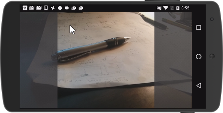

#ezAR squareCam 
This JavaScript utility simulates a square camera when used with the ezAR VideoOverlay 
plugin for Cordova. Call squareCam.enable() to reveal a css stylable mask that crops 
the cameraView dimensions to square. The mask size and positioning is updated on each
orientationChange. Modify mask appearance in squareCam.css.  

Note: this utility does not work with the ezAR snapshot plugin for creating square images. 
See additional notes below for more info.  

##Getting Started
Copy the squareCam.css and squareCam.js files into your project and add to your main html file.

         <link rel="stylesheet" type="text/css" href="pathto/squareCam.css">
         

Next reveal the squareCam masks to simulate a square cameraView using the 
JavaScript api, 

         squareCam.enable() 

Return to full screen cameraView using

         squareCam.disable()

Here's a snippet that works starts the ezAR VideoOverlay plugin in a square format

        ezar.initializeVideoOverlay(
            function() {
                ezar.getBackCamera().start(
                   function() { squareCam.enable() });
                },
            function(err) {
                alert('unable to init ezar: ' + err);
        });
                    
##Additional Documentation and Notes       
See [ezartech.com](http://ezartech.com) for documentation and support.

This utility is a quick html-based implementation that I created to stand in until I have implemented
native square video and snapshot support. My goal is to obsolece this utility asap. 

##License
squareCam is licensed under a [modified MIT license](http://www.ezartech.com/ezarstartupkit-license).

Copyright (c) 2015-2016, ezAR Technologies

